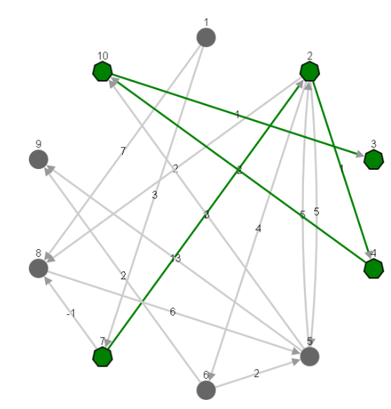
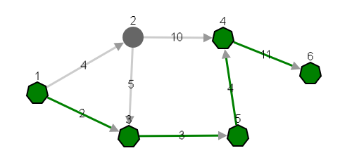

[Click here to try it yourself](https://d0ubletr0uble.github.io/)

Instructions:
Find shortest path: Click main button and then click start and end nodes

Main button click after path was drawn returns to creator mode

To add node: double left mouse button click

To delete element: right button click

To add connection: left click on 2 nodes

Resize graph: scroll

For mobile devices:
Add node: tap and hold
Remove element: 2 finger tap

[Norint išbandyti programą spauskite čia](https://d0ubletr0uble.github.io/)

Dokumentacija:

Sudaryti trumpiausią kelią: spustelti vidurinį mygtuką, tada pasirinkti pradinę ir galutinę viršūnes.

Po kelio sudarymo pagrindinio mygtukio spustelėjimas sugražina kūrimo režimą.

Norint sukurti viršūnę: 2 kart spustelėkite kairiuoju pelės klavišu.

Norint panaikinti elementą: spustelėkite ant jo dešiniu pelės klavišu.

Lankas sukuriamas pažymint 2 viršūnes ir įvedant svorį.

Padidinti-sumažinti grafą: sukti pelės ratuką.

Mobiliųjų įrenginių naudotojams:

Norint sukurti viršūnę: paspauskite ir palaikykite toje vietoje kur norite, kad ji būtų sukurta ("touch and hold").

Norint panaikinti elementą: spustelkite ant jo dviem pirštais vienu metu.
